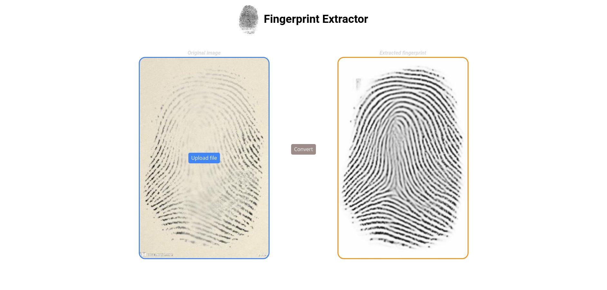

# Fingerprint Inpainting / Restoration

This is a project of examining various solutions for a Fingerprint
Inpainting task (can be found here:
https://paperswithcode.com/dataset/fingerprint-inpainting-and-denoising)

A big inspiration was the following article (along with the paper): 
["Fingerprint Denoising and Inpainting using Fully Convolutional Networks"](https://towardsdatascience.com/fingerprint-denoising-and-inpainting-using-fully-convolutional-networks-e24714c3233)

## Models Performance Comparison

| Model                | SSIM       | PSNR        |
|----------------------|------------|-------------|
| Custom Conv + Dense  | 0.0997     | 11.7853     |
| Custom Autoencoder   | 0.3563     | 13.9658     |
| U-Net (MSE loss)     | **0.6989** | **17.0378** |
| U-Net (MS-SSIM loss) | 0.3631     | 12.7265     |
| U-Net (MAE loss)     | 0.2409     | 9.0918      |
| Pix2Pix GAN          | 0.6266     | 14.3752     |

## Analyzed Models Details(4 in total)

### Custom Convolutional + Dense
This model was a sort of "foolish first attempt" at solving the task
(as is evident from the architecture)

<b>Architecture:</b>
<i>
- 3 x [Conv2D + MaxPooling2D]
- Flatten
- Dense + Dense (IMAGE_HEIGHT x IMAGE_WIDTH) units
- Reshape to (IMAGE_HEIGHT x IMAGE_WIDTH)
</i>

<b>Results: </b>

### Custom Autoencoder
This models implements a fully convolutional autoencoder-like architecture

<b>Architecture:</b>
<i>
- Encoder
  - 3 x [Conv2D + MaxPooling2D]
- Decoder
  - 3 x [Conv2D + UpSampling2D]
  - Conv2D
</i>

<b>Results: </b>

### U-Net
The U-Net architecture is well known and very popular for image-to-image
tasks - for us it turned out to be also the best-performing.

<b>Results: </b>

### Pix2Pix (U-Net + GAN)
This model is based on the Pix2pix model:
https://www.tensorflow.org/tutorials/generative/pix2pix#build_the_generator 
 It is a Conditional Generative Adversarial Networks with a U-Net-type 
model as the generator.

As you can observe on the result below, the discriminator we trained was too 
weak - therefore the generator gets away with
**generating real-looking, but completely untrue images**
(look at the fingerprint lines in detail)

<b>Results: </b>

## DEMO

### Introduction

A frontend was created using **React** and **Axios** libraries.
The website allows to upload any image with hidden fingerprint
(real or artificial), and after clicking a proper button, it shows an estimated
monochromatic fingerprint.

A backend was written using **FastAPI**. Loads U-net model at startup (implemented
in Keras), and listens to requests on `http://localhost:8000/api/v1/unet`.
Uses the best found hyperparameters during the mentioned experiments.

### How To Use:

  1. Go to `http://localhost:3000`
  1. Upload any image with real or artificial fingerprint by pressing
`Upload file`. You can use any of images from `sample_images` directory.
  1. Click `Convert`
  1. After a while, an estimated monochromatic fingerprint will be shown
on the right.

### How To Install:

  1. Download weights from the release (`model_mse.15.zip`).
  1. Put downloaded weights to `weights` directory. Decompress the content.
  1. Make sure you have Docker installed. Then, type a command
  `docker-compose build`.
  1. Type a command `docker-compose up -d`.
  1. Enjoy your experiments!